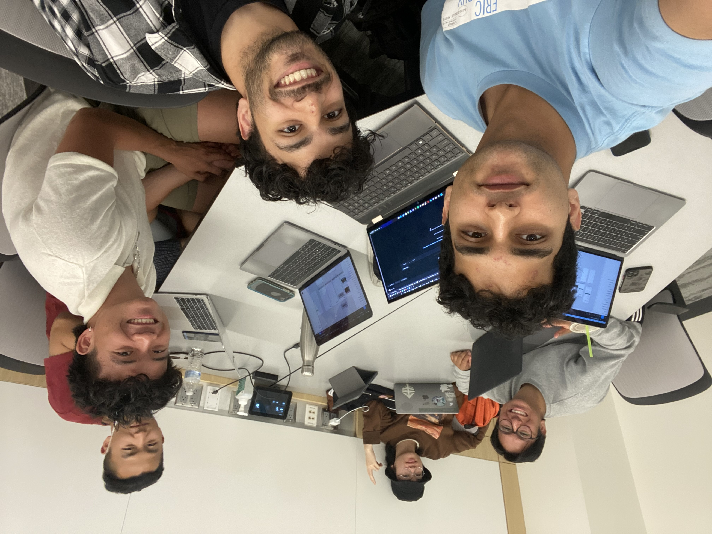
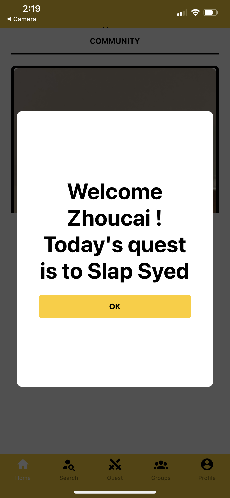
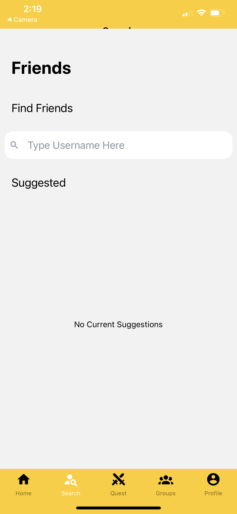
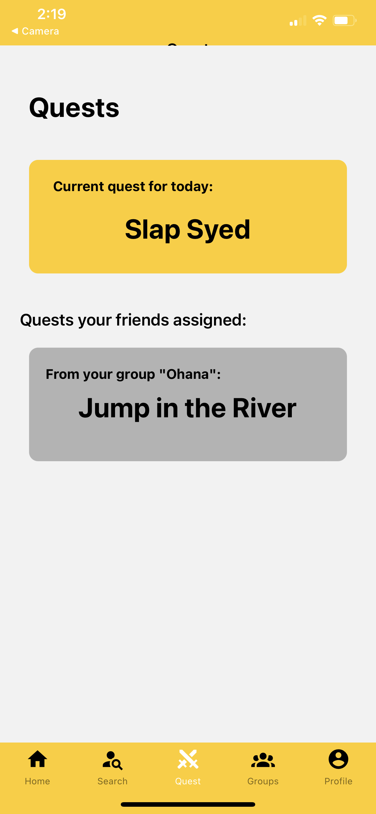
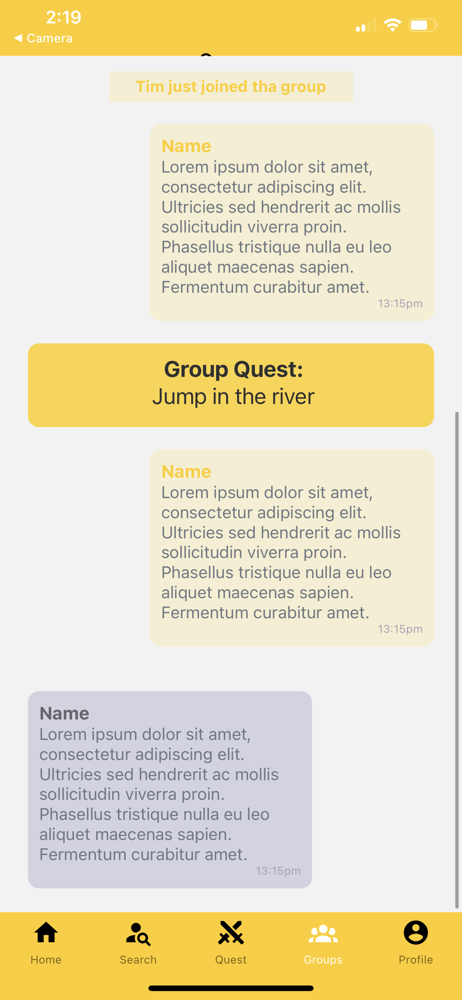
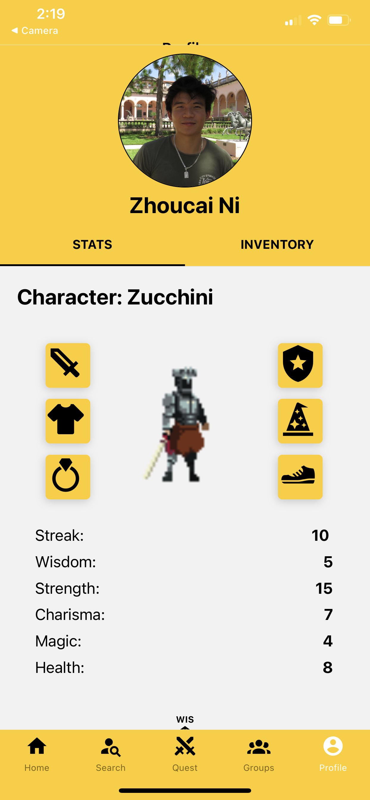

# SideQuest

[_how?_](https://docs.github.com/en/repositories/managing-your-repositorys-settings-and-features/customizing-your-repository/about-readmes#relative-links-and-image-paths-in-readme-files)

Short project description, some sample screenshots or mockups

- Creating an app called sideQuest where users are given daily  quests to complete and display the quests on a feed page comparing it to their friends.
  
  - 
  - 
  - 
  - 
  - 
   - 

## Architecture

- React Native for frontend
- MongoDb, Express for backend
- Others

## Setup

- To install all the node modules, use `yarn install`.

## Deployment

TODO: Install the expo go app on your apple device and run the the yarn start command in the terminal. Open the local host link and switch to tunnel and then scan the Qr code on your iphone camera app after clicking the tunnel button and you'll be able to run the app! 

## Authors

Done: Zhoucai Ni, Ke Lou, Jose Hernandez Barbosa, Kashan Mahmood, Ryan Luu, Syed Hussaini

## Acknowledgments

- I love my teammates -Zhoucai
- Teammates were homies and we got it done- Syed
- Goodjob team - Ke
- Wonderful ideas wonderful people - Jose
- Keep building team! - Ryan
- Good work team. Love the idea and the execution. HAGS - Kashan

- Jordan Sanz (TA) and Sathvika Korandla (TA), and Tim Tregubov for being amazing and wonderful help!

=======
- These were original pull reuqests ignore
- also changing one line beep
- changing one line for pull request beep boop
- Very important change to readme file
