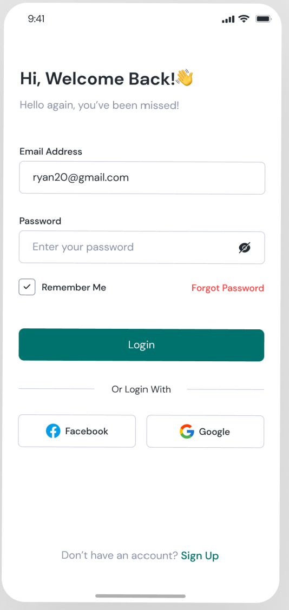
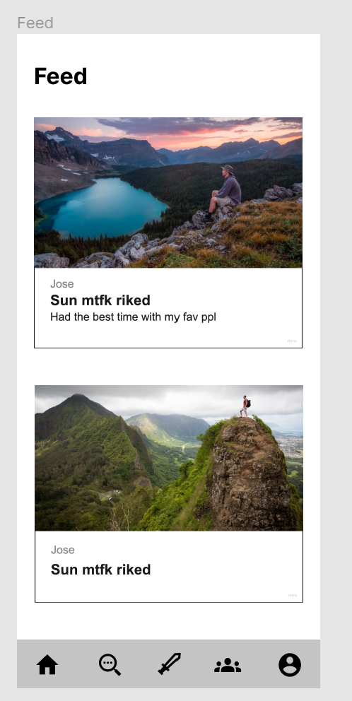

# SideQuest

[*how?*](https://docs.github.com/en/repositories/managing-your-repositorys-settings-and-features/customizing-your-repository/about-readmes#relative-links-and-image-paths-in-readme-files)

TODO: short project description, some sample screenshots or mockups
- Creating an app called sideQuest where users are given daily tasks to complete and compete against their friends with
a leaderboard and close friends feature as well!. 
- )
- )

## Architecture

- React Native for frontend 
- MongoDb, Express for backend
- Others

## Setup
- To install all the node modules, use `yarn install`.

## Deployment

TODO: ~work in progress 

## Authors

TODO: Zhoucai Ni, Ke Lou, Jose Hernandez Barbosa, Kashan Mahmood, Ryan Luu, Syed Hussaini

## Acknowledgments
I love my teammates -Zhoucai

=======
- Will be added in but Jordan Sanz (TA) and Sathvika Korandla (TA), and Tim Tregubov
